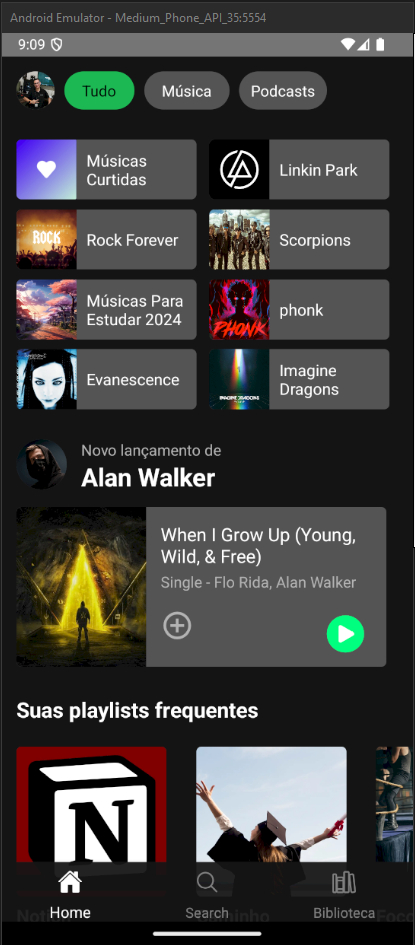
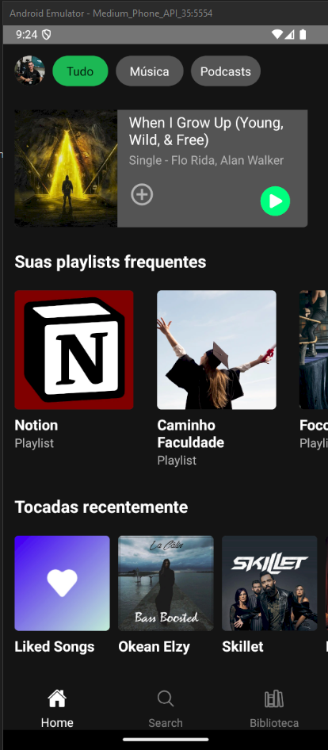
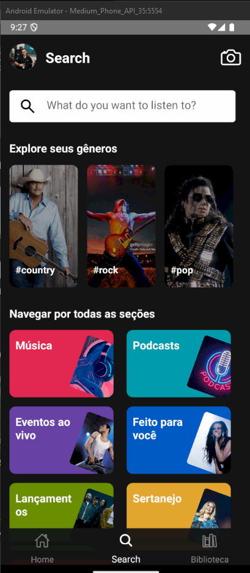
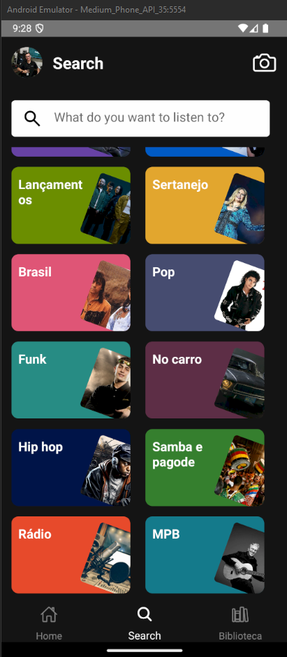
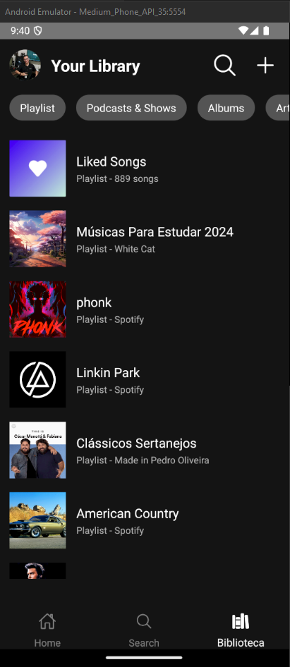
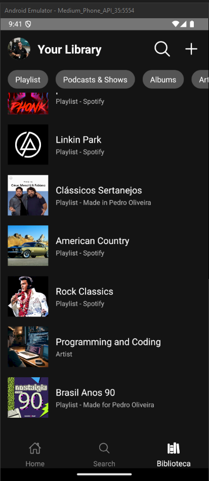

# Spotify React Native
Refiz o aplicativo do **Spotify** em **React Native**. Desenvolvi a tela de Home, Pesquisa e de Biblioteca. Programei o sistema o mais parecido possível, com maior semelhança.

## Objetivo
Estudar e treinar minhas habilidades em React Native.

## Tecnologia
- React Native

## Orgnanização do projeto
- Criação de elementos globais
- Pastas
- Reaproveitamento de códigos

## Layout
Todo layout está o mais fiel possível ao App original. Todos os cars horizontais e a TabBar estão 100% funcionando.

## Telas
- Cores padrões do Spotify
- Ícones padrões
- TabBar
- Seções existentes

### Home
- Header
- Músicas curtidas e recentes
- Músias lançadas recentemente
- Playlist frequentes
- Tocadas recentementes

### Search
- Header
- Campo de pesquisa
- Explore gêneros musicais
- Navegar pelas seções

  

### Biblioteca
- Header
- Seção opções
- Playlist frequentes

  